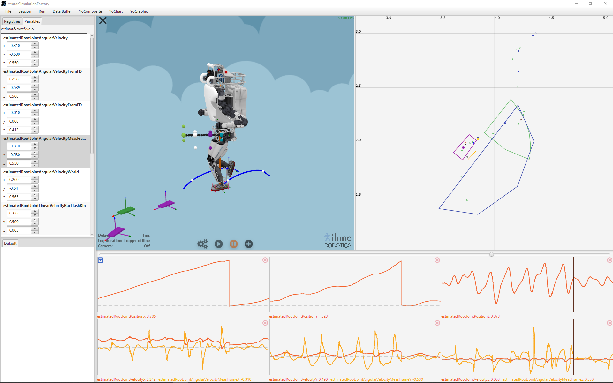
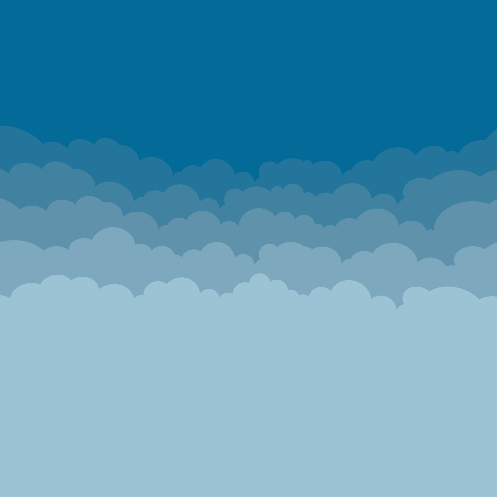

# 

# This is an alpha version
This version is not bug-free and still misses lots of features.
Do not expect a fully functional application, however the main features should be available to make it usable.
If you'd like to help improving this application, please provide feedback and I'll do my best to include them in the next release. Note that this is, until further notice, an application I develop in my free time, so development can be slow.
Any type of feedback would be greatly appreciated, in particular:
- If the application throws an exception, the most helpful set of information is: strack-trace of the exception (available from the console) and the steps you proceeded through the GUI before getting the exception so I can reproduce the issue locally.
- Missing minor features: when it feels like there should be that one small option, for instance a button to reset a view or something, available to the user but it's not there. They're often easy to implement without involving large development and still make the application much better.
- Missing major features: provide context or a concrete example illustrating the need for a new major feature. A major feature is for instance: the ability to record videos (already in the roadmap) or the ability to do some post-processing on the YoVariables. It will very likely take a while to implement it, but may be so much worth it.
- GUI visual feel: Ugh that button is ugly... That background could be darker... Well if that helps making the GUI look nicer, everybody will enjoy it.
- GUI unexpected/frustrating behavior: When after hitting that button 30 times you're still expecting a different result and that is frustrating... If you can provide the details on what's unexpected/frustrating and what you would expect, that'll help make the GUI fell smoother to work with.

Every version will be attributed a date, for example `SCS2-alpha-20191009`, please provide the version when providing feedback.

# GUI differences and limitations w.r.t. to SCS1
- Where is the search panel? See that hamburger control in the top left corner of the 3D view? There, click it.
- Where do you I create empty charts? You see that small blue square with an inverted triangle in the top left corner of the chart area? There, click it.
- There's too few control buttons, where the others? See that "plus" button? There, click it.
- The navigation controls for the 3D view differ from SCS1, they are the same to our other JavaFX GUI applications though and all controls are available when using a touchpad instead of a mouse.
- Overhead plotter navigation controls differ from SCS1. Left click'n'drag: translate. Right click'n'drag zoom in/out. Note that all controls are available when using a touchpad instead of a mouse.
- The camera is not tracking the robot?? Right click on the graphic you want to track.
- Can I visualize a log? Go to the menu `Session > Start log session...`.
- Can connect to a remote session? Go to the menu `Session > Start remote session...`.
- I can't record a video... Yup, it's under development.
- Can I simulate stuff? Nope, that is quite further down the road :'(

# Main new features compared to SCS1 Visualizer
## `YoComposite`
A `YoComposite` is a group of `YoVariable`s that represents a high-level of information.
The main advantage of `YoComposite`s is the ability to search for a specific type of composite which better filters searched, and also the ability to plot all the components of the composite over one or more charts given a predefined configuration.

There is a default set of `YoComposite` defined in SCS2:
- `YoTuple2D` & `YoTuple3D`: represent respectively 2D & 3D points and/or vectors.
- `YoQuaternion`: represents orientations defined as quaternions.
- `YoYawPitchRoll`: represents orientations defined as Euler angles or yaw-pitch-roll angles.

To search for a certain `YoComposite`, open the search panel, to right of the search field, click that button with "..." and change the search target in the dialog that pops up.

Custom `YoComposite`s can be defined view the menu _YoComposite > YoCompositePattern properties..._
Preferred chart configurations for each custom composite can also be defined there. You can export/import custom `YoComposite` to a file via _YoComposite > Load/Save YoCompositePattern..._.

## `YoGraphic`
While `YoGraphic` were available in SCS1 by implementing them in Java, they are available from the GUI in SCS2.

`YoGraphic3D` represents the group of 3D graphics that will show up in the 3D view, while `YoGraphic2D` represents the group of 2D graphics that will show up in the overhead plotter. The latter can be displayed via the menu _YoGraphic > Overhead Plotter_.
`YoGraphic`s can be created via the menu _YoGraphic > YoGraphic properties..._. You can export/import `YoGraphic` to a file via _YoComposite > Load/Save YoGraphic..._.

# How to get it?
## Executable version:
The binaries can be downloaded from the release section of the GitHub page: <a href="https://github.com/ihmcrobotics/simulation-construction-set-2/releases">Release page</a>.
## From source:
Keep in mind that this project being at the alpha stage it'll be refactored quite several times. If you still want to have it from source, I recommend not making development that depends on it. If you want to make development on top of it, that is at your own risk, development on SCS2 will not consider dependencies.

You'll need to clone this repository and at times source dependencies will be required most likely including: `ihmc-javafx-toolkit`, `ihmc-robot-data-logger`, `ihmc-graphics-description`.

# External references:
## Icons:
-  &  icons from <a href="https://icons8.com/icons/">Icons8</a>

## Skybox:
-  default skybox from <a href="https://assetstore.unity.com/packages/2d/textures-materials/sky/farland-skies-cloudy-crown-60004">Cloudy Crown Skybox</a>

