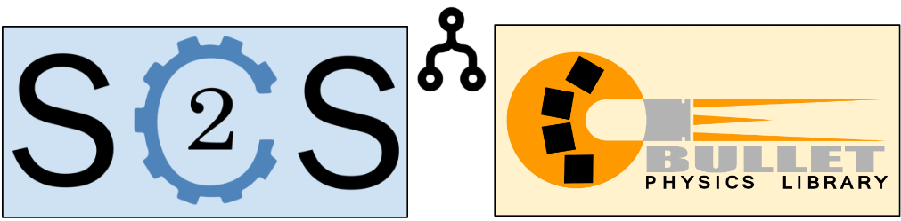
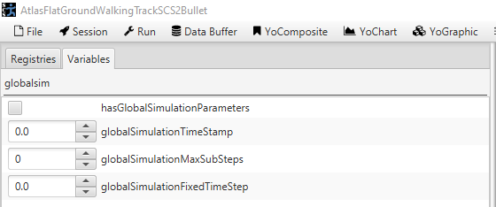
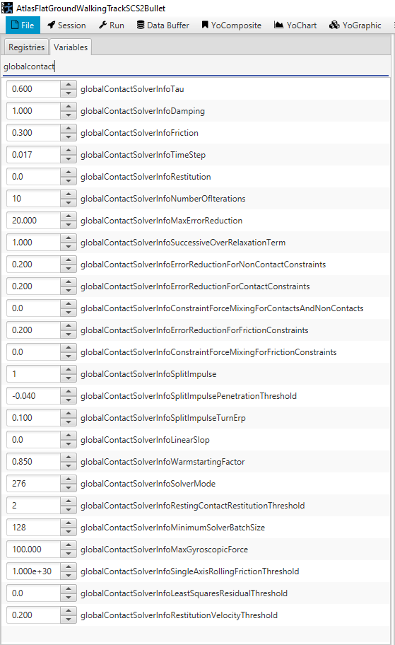
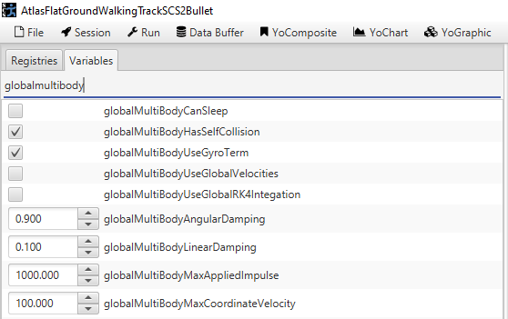
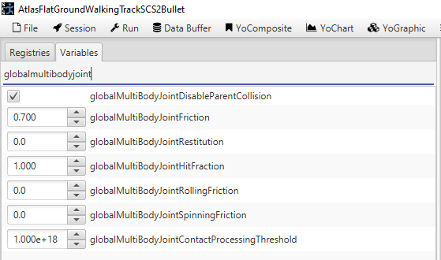

# SCS2 - Bullet Physics Engine Notes

SCS2 has the ability to use the Bullet Physics Engine while running a simulation. To run SCS2 using the Bullet Physics Engine, create a new SimulationSession with BulletPhysicsEngineFactory.newBulletPhysicsEngineFactory() as the physicsEngineFactory. If a simulation is using the BulletPhysicsEngine, then a btMultiBody object will be created for each Robot added to the simulation and a btRigidBody object will be created for each Terrain added. The Bullet Physics Engine will keep the btMultiBodies and Robots in sync before and after each simulation step.

**Example**: 
SimulationSession simulationSession = new SimulationSession(BulletPhysicsEngineFactory.newBulletPhysicsEngineFactory());

The Bullet Physics Engine has four parameter files you can setup prior to starting the simulation or change the values using YoVariables.

- Simulation Parameters
- Contact Solver Info Parameters
- MultiBody Parameters
- MultiBody Joint Parameters

# Simulation Parameters

By default, Bullet does not use Simulation Parameters. It uses the sessionDTSeconds that was setup when the SimulationSession was created. For each simulation step, Bullet allows the user to set up a timeStamp, maxSubSteps, and a fixedTimeStep. If a BulletSimulationParameters object has not been setup in the BulletPhysicsEngine, then the values will be timeStep = sessionDTSeconds, maxSubSteps = 1, and fixedTimeStep = sessionDTSeconds. To use values other than these, create a BulletSimulationParmeters object and pass it to BulletPhysicsEngine method setGlobalSimulationParameters or change the values directly using the YoVariables: hasGlobalSimulationParameters, globalSimulationTimeStamp, globalSimulationMaxSubSteps, and globalSimulationFixedTimeStep. The values will be ignored unless hasGlobalSimulationParameters is checked.

**btMultiBodyDynamicsWorld.stepSimulation(timeStep, maxSubSteps, fixedTimeStep);**

**TimeStep** - the amount of time in seconds to step the simulation. Typically, this is the time since the method was last called.

**MaxSubSteps** - the maximum number of steps that Bullet is allowed to take each time you call StepSimulation. Generally, keep it as 1 so Bullet interpolates the current values on its own. A value of zero implies a variable tick rate, meaning Bullet advances the simulation exactly timeStep seconds instead of interpolating. A value greater than one must satisfy the equation timeStep < maxSubSteps * fixedTimeStep or the simulation will lose time.

**FixedTimeStep** - regulates resolution of the simulation. 

# Contact Solver Information Parameters

Bullet allows parameters to be setup prior to simulation, to determine how rigidBodies and multiBodies interact when contact is made. These parameters can be updated by creating a BulletContactSolverInfoParameters object and passing it the BulletPhysicsEngine or by changing the YoVariables. The YoVariables begin with "globalContactSolverInfo".

**Example to add BulletContactSolverInfoParameters:** 
BulletContactSolverInfoParameters bulletContactSolverInfoParameters = BulletContactSolverInfoParameters.defaultBulletContactSolverInfoParameters(); 
bulletContactSolverInfoParameters.setErrorReductionForContactConstraints(0); 

simulationSession = new SimulationSession(BulletPhysicsEngineFactory.newBulletPhysicsEngineFactory(BulletMultiBodyParameters.defaultBulletMultiBodyParameters(), BulletMultiBodyJointParameters.defaultBulletMultiBodyJointParameters(), bulletContactSolverInfoParameters)); 

The variables are as follows:

**Tau** - default value is 0.6.

**Damping** - default value is 1.0. Global non-contact constraint damping, that can be locally overridden by constraints.

**Friction** - default value is 0.3.

**TimeStep** - default is 1f / 60f. In the btSequentialImpulseConstraintSolver class, it is used as the timeStep to compute things such as the positionalError of contact points; gryoscopic impulse; external torque impulse; and applied force and torque on bodies.

**Restitution** - default is 0.0.

**MaxErrorReduction** - default is 20.0.

**NumberOfIterations** - default is 10.0. The max number of iterations used by the solver for contact/friction constraints.

**SuccessiveOverRelaxationTerm** - default is 1. If this value is set, it relaxes the penetration impulse and velocity impulse between two bodies when they have contact. 

**ErrorReductionForNonContactConstraints** - default is 0.2. For non-contact constraints, adjusts the penetration impulse, which is (-distance x erp / TimeStep) x (SuccessiveOverRelaxationTerm / d) where d = impulse denominator of body1 + impulse denominator of body2 + constraintForceMixing(cfm).

**ErrorReductionForContactConstraints** - default is 0.2. For contact constraints, adjusts the penetration impulse, which is (-distance x erp / TimeStep) x (SuccessiveOverRelaxationTerm / d) where d = impulse denominator of body1 + impulse denominator of body2 + constraintForceMixing(cfm).

**ConstraintForceMixingForContactsAndNonContacts** - default is 0. Global constraint force mixing(cfm). Cfm is used in the calculation to calculate penetration impulse (see above) and delta impulse, which is rhs - applied impulse * cfm where rhs equals the penetration impulse + velocity impulse or velocity impulse depending on how the other parameters are set. There are several cfm parameters and the one used depends on the solver mode.

**ErrorReductionForFrictionConstraints** default is 0.2. For friction constraints, adjusts the penetration impulse, which is (-distance x erp / TimeStep) x (SuccessiveOverRelaxationTerm / d) where d = impulse denominator of body1 + impulse denominator of body2 + constraintForceMixing(cfm).

**constraintForceMixingForFrictionConstraints** default is 0. Friction constraint force mixing (cfm). Cfm is used in the calculation to calculate penetration impulse (see above) and delta impulse, which is rhs - applied impulse * cfm where rhs equals the penetration impulse + velocity impulse or velocity impulse depending on how the other variables are set. There are several cfm variables and the one used depends on the solver mode.

**SplitImpulse** - default is 1. 1 equals true and 0 equals false. **Split impulse is not implement yet for btMultiBody**. For btRigidBodies, indicates whether or not to use split impulse when calculating the penetration impulse which is either penetration impulse + velocity impulse if false or splits position and velocity when calculating the impulse.

**SplitImpulsePenetrationThreshold** - default is -0.04. **Split impulse is not implement yet for btMultiBody**. For btRigidBodies, if SplitImpulse is true and the penetration distance between two objects is less than the penetration threshold then split position and velocity into rhs and rhsPenetration; otherwise, combine position and velocity into rhs.

**SplitImpulseTurnErp** - default is 0.1. **Split impulse is not implement yet for btMultiBody**. For btRigidBodies, if SplitImpulse is true, this value is used to correct the position/orientation based on push/turn recovery. The turn velocity is multiplied by the SplitImpulseTurnErp to calculate the transform of the objects.

**linearSlop** - default is 0.0. When calculating the distance between two objects adds the linearSlop to the the distance.

**WarmstartingFactor** - default is 0.85. If SolverMode has SOLVER_USE_WARMSTARTING enabled, then adds the value in WarmstartingFactor to the applied impulse. Note: the default SolverMode has SOLVER_USE_WARMSTARTING set.

**SolverMode** - default is SOLVER_USE_WARMSTARTING | SOLVER_SIMD | SOLVER_USE_2_FRICTION_DIRECTIONS. 
 
>**The possible values for Solver Mode are:** 
 
<ul>
<li>**SOLVER_RANDMIZE_ORDER** - when this flag is enabled, the ordering of phases, and the ordering of constraints within each batch is randomized, however, it does not swap constraints between batches. This is to avoid regenerating the batches for each solver iteration which would be quite costly in performance.</li> 
<li>**SOLVER_FRICTION_SEPARATE** - No information found for this flag.</li> 
<li>**SOLVER_USE_WARMSTARTING** - when this flag is enabled, multiplies the value in WarmstartingFactor with the applied impulse.</li> 
<li>**SOLVER_USE_2_FRICTION_DIRECTIONS** - when this flag is enabled, the solver will use two friction directions. The second friction direction will be orthogonal to both contact normal and friction direction.</li> 
<li>**SOLVER_ENABLE_FRICTION_DIRECTION_CACHING** - when this flag is enabled, the solver will not recalculate friction values each frame.  
<li>**SOLVER_DISABLE_VELOCITY_DEPENDENT_FRICTION_DIRECTION** - when this flag is enabled, the friction will be independent from the relative projected velocity. </li> 
<li>**SOLVER_CACHE_FRIENDLY** - No information found for this flag.</li> 
<li>**SOLVER_SIMD** - when this flag is enabled the solver functions will use SIMD.</li> 
<li>**SOLVER_INTERLEAVE_CONTACT_AND_FRICTION_CONSTRAINTS** - when this flag is enabled, the rolling friction is interleaved as well. Interleaving the contact penetration constraints with friction reduces the number of parallel loops that need to be done, which reduces threading overhead so it can be a performance win, however, it does seem to produce a less stable simulation, at least on stacks of blocks.</li> 
<li>**SOLVER_ALLOW_ZERO_LENGTH_FRICTION_DIRECTIONS** - No information found for this flag.</li> 

**RestingContactRestitutionThreshold** - default is 2. This value is unused as of version 2.81.

**MinimumSolverBatchSize** - default is 128. The solver tries to combine islands until the amount of constraints reaches this limit.

**MaxGyroscopicForce** - default is 100.0. If the btRigidBody is set to BT_ENABLE_GYROSCOPIC_FORCE_EXPLICIT then clamp forces for the body to the value in this field.

**SingleAxisRollingFrictionThreshold** - default is 1e30f. If the velocity is above this threshold, it will use a single constraint row (axis), otherwise, it uses three rows.

**LeastSquaresResidualThreshold** - default is 0. Used in the solver method named solveGroupCacheFriendlyIterations. After solving a single iteration, a leastSquaresResidual is returned. If that value is equal to or greater than the value in this field then it will solve another single iteration step. Note: a non-zero leastSquaresResidualThreshold could possibly affect the determinism of the simulation if the task scheduler's parallelSum operation is non-deterministic. The parallelSum operation can be non-deterministic because floating point addition is not associative due to rounding errors. The task scheduler can and should ensure that the result of any parallelSum operation is deterministic.

**RestitutionVelocityThreshold** - default is 0.2. If the relative velocity is below this threshold, there is zero restitution.

# MultiBody Parameters

Bullet allows parameters of btMultiBodies to be changed for a simulation. These parameters can be updated by creating a BulletMultiBodyParameters object and passing it the BulletPhysicsEngine or by changing the YoVariables. The YoVariable begin with "globalMultiBody". If the simulation has multiple robots, the BulletMultiBodyParameters will be applied to all the btMultiBodies.

**Example to add BulletMultiBodyParameters:** 
BulletMultiBodyParameters bulletMultiBodyParameters = BulletMultiBodyParameters.defaultBulletMultiBodyParameters(); 
bulletMultiBodyParameters.setLinearDamping(0); 

simulationSession = new SimulationSession(BulletPhysicsEngineFactory.newBulletPhysicsEngineFactory(bulletMultiBodyParameters, BulletMultiBodyJointParameters.defaultBulletMultiBodyJointParameters()); 
       

**CanSleep** - default is false. A true/false parameter that indicates if the btMultiBody can sleep. btMultiBody has a method called checkMotionAndSleepIfRequired. It the btMultiBody can sleep and the motion is less than the sum of squares of joint velocities, then the btMultiBody is commanded to go to sleep. Once the motion is no longer less than the sum of the square of joint velocities, the btMultiBody will be commanded to wake up.

**HasSelfCollision** - default is true. Set to true if the btMultiBody can collide with itself.

**UseGyroTerm** - default is true. If true, adds baseInertia cross the angular part of the spatial Velocity to the external forces array.

**UseGlobalVelocities** - default is false. If true, uses global velocities to calculate spatial velocity and spatial joint velocity.

**UseRK4Integration** - default is false. If true, uses RK4 integration to solve internal constraints.

**LinearDamping** - default is 0.04. The amount of linear damping applied when computing acceleration.

**AngularDamping** - default is 0.04. The amount of angular damping applied when computing acceleration. 

**MaxAppliedImpulse** - default is 1000.0. It looks like the logic for this field is commented out so it might be used.

**MaxCoordinatedVelocity** - default is 100.0. Clamps the velocity of the btMultiBody to +/- the amount in this field.

# MultiBody Joint Parameters

Bullet allows the joint parameters of the btMultiBodies to be changed for a simulation. These parameters can be updated by creating a BulletMultiBodyJointParameters object and passing it the BulletPhysicsEngine or by changing the YoVariables. The YoVariable begin with "globalMultiBodyJoint". If the simulation has multiple robots, the BulletMultiBodyJointParameters will be applied to all joints on all the btMultiBodies.

**Example to add BulletMultiBodyJointParameters:** 
BulletMultiBodyJointParameters bulletMultiBodyJointParameter = BulletMultiBodyJointParameters.defaultBulletMultiBodyJointParameters() ;
bulletMultiBodyJointParameter.setJointRestitution(0); 
 

simulationSession = new SimulationSession(BulletPhysicsEngineFactory.newBulletPhysicsEngineFactory(BulletMultiBodyParameters.defaultBulletMultiBodyParameters(), bulletMultiBodyJointParameter); 

**JointDisableParentCollision** - default is true. If this value is set to true, the joints will not collide with their parent joint.

**JointFriction** - default is 0.5. The amount of friction applied to each joint.

**JointRestitution** - default is 0.0. Update this parameter to set the coefficient of restitution for each joint of the multibodies. The coefficient of restition is the ratio of the final to initial relative speed between two objects after they collide. Note: Bullet multiplies the restitution of each object to calculate the final coefficient of restitution. So if two balls have restitution of 0.7, then at collision the restitution will be calculated as 0.7 * 0.7 = 0.49. 
 
Note: Add the following BulletContactSolverInfoParameters parameter to a simulation to make the restitution more accurate.  
BulletContactSolverInfoParameters bulletContactSolverInfoParameters = BulletContactSolverInfoParameters.defaultBulletContactSolverInfoParameters(); 
bulletContactSolverInfoParameters.setSplitImpulse(1); 
bulletContactSolverInfoParameters.setSplitImpulseTurnErp(1.0f); 
bulletContactSolverInfoParameters.setSplitImpulsePenetrationThreshold(-0.0000001f); 
bulletContactSolverInfoParameters.setErrorReductionForNonContactConstraints(0); 
bulletContactSolverInfoParameters.setErrorReductionForContactConstraints(0); 

**JointHitFraction** - default is 1.0. Clamps integrated transforms to the hit fraction.

**JointRollingFriction** - default is 0.0. Rolling Friction is torsional friction orthogonal to contact normal. It is useful to stop spheres rolling forever. Generally, it is best to leave the rolling friction to zero, to avoid artifacts.

**JointSpinningFriction** - default is 0.0. Spinning Friction is torsional friction around the contact normal. It is useful for grasping.

**JointContactProcessingThreshold** - default is 9.9999998E17. The constraint solver can discard solving contacts, if the distance is above this threshold. Note: that using contacts with positive distance can improve stability. It increases, however, the chance of colliding with degenerate contacts, such as 'interior' triangle edges

# External references:

Bullet Documentation: [https://pybullet.org/Bullet/BulletFull/index.html](https://pybullet.org/Bullet/BulletFull/index.html)

Bullet Github: [https://github.com/bulletphysics/bullet3](https://github.com/bulletphysics/bullet3)

libgdx Github: [https://github.com/libgdx/libgdx/tree/master/extensions/gdx-bullet](https://github.com/libgdx/libgdx/tree/master/extensions/gdx-bullet)

libgdx.com [https://libgdx.com/wiki/extensions/physics/bullet/bullet-physics](https://libgdx.com/wiki/extensions/physics/bullet/bullet-physics)

Bytedeco / javacpp-presets [https://github.com/bytedeco/javacpp-presets/tree/master/bullet](https://github.com/bytedeco/javacpp-presets/tree/master/bullet)

